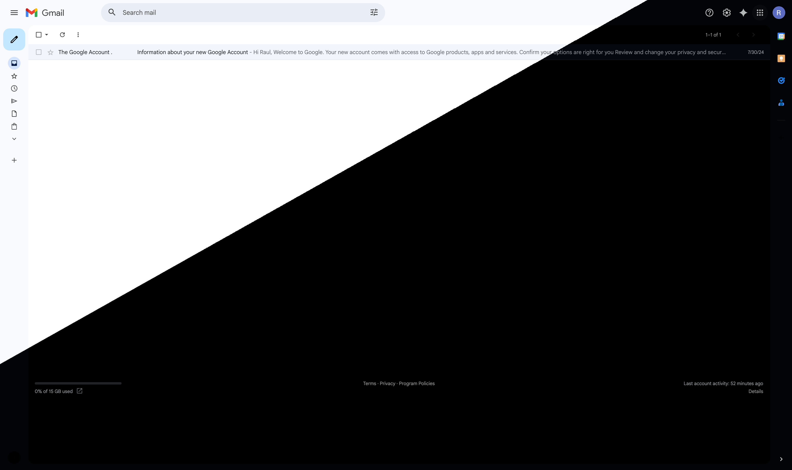

# Gmail Dark Mode Switcher

[](https://addons.mozilla.org/en-US/firefox/addon/gmail-dark-mode-switcher/)
[](https://addons.mozilla.org/en-US/firefox/addon/gmail-dark-mode-switcher/)
[](https://addons.mozilla.org/en-US/firefox/addon/gmail-dark-mode-switcher/)
[](https://opensource.org/licenses/MIT)

A Firefox extension that automatically syncs Gmail's theme with your system preferences, providing a seamless dark mode experience. Now with manual controls!

## ✨ Features

- 🔄 **Auto Mode** - Sync Gmail with system preferences
- 🌙 **Manual Dark Mode** - Force dark theme anytime
- ☀️ **Manual Light Mode** - Force light theme anytime
- 🎨 **Popup Controls** - Easy theme switching from toolbar
- ⚡️ **Instant Transitions** - Smooth, fast theme changes
- 🏞️ **Image Preservation** - Maintains original image quality
- 👓 **Readable Content** - Optimized text contrast
- ⚫️ **Full Coverage** - Works everywhere including compose window
- 🔄 **Account Switching** - Consistent theme across all Gmail accounts

## 📸 Screenshots

### Light Mode vs Dark Mode



## 🚀 Installation

### From Mozilla Add-ons (Recommended)

1. Visit the [Mozilla Add-ons page](https://addons.mozilla.org/en-US/firefox/addon/gmail-dark-mode-switcher/)
2. Click "Add to Firefox"
3. Enjoy!

### Manual Installation (Developer Mode)

1. Download or clone this repository:
   ```bash
   git clone https://github.com/raulpop8/gmail-theme-switcher-firefox.git
   ```
2. Open Firefox and navigate to `about:debugging`
3. Click "This Firefox" in the sidebar
4. Click "Load Temporary Add-on..."
5. Navigate to the extension folder and select `manifest.json`

## 🎯 Usage

### Automatic Mode (Default)
Once installed, the extension automatically syncs with your system theme. No configuration needed!

### Manual Control
Click the extension icon in your toolbar to access theme controls:
- **Auto** - Follow system preferences
- **Light** - Always use light mode
- **Dark** - Always use dark mode

### Keyboard Shortcuts
Currently no keyboard shortcuts available. Coming in a future update!

## 📋 Changelog

### Version 1.3 (Current)
- ✨ Added popup UI for manual theme control
- 🎨 Three theme modes: Auto (system), Light, Dark
- 🌗 Popup adapts to system light/dark theme
- ☕ Added Ko-fi support button
- 🐛 Fixed white backgrounds in compose window
- 🔍 Fixed search bar staying white when switching accounts
- ✅ Improved overall dark mode consistency

### Version 1.2
- 🎨 Enhanced dark mode color accuracy
- 🐛 Bug fixes and performance improvements

### Version 1.1
- 🚀 Initial public release
- 🔄 Auto-sync with system preferences
- ⚫️ Basic dark mode implementation

## 🛠️ Development

### Project Structure
```
gmail-theme-switcher-firefox/
├── manifest.json          # Extension configuration
├── background.js          # Background service worker
├── content.js            # Content script for Gmail
├── styles.css            # Dark mode styles
├── popup.html            # Popup interface
├── popup.css             # Popup styles
├── popup.js              # Popup logic
├── icons/                # Extension icons
└── LICENSE               # MIT License
```

### Building from Source

1. Clone the repository
2. Make your changes
3. Test in Firefox using `about:debugging`
4. Submit a pull request!

## 🤝 Contributing

Contributions are welcome! Here's how you can help:

1. 🐛 **Report bugs** - Use the [Issues](https://github.com/raulpop8/gmail-theme-switcher-firefox/issues) tab
2. 💡 **Suggest features** - Open a feature request
3. 🔧 **Submit pull requests** - Fork, change, and submit!
4. ⭐ **Star this repository** - Show your support

## 🐛 Reporting Issues

Found a bug? Please report it!

**Via Extension:**
- Click the extension icon → "🐛 Report Issue"

**Via GitHub:**
- Open an [issue](https://github.com/raulpop8/gmail-theme-switcher-firefox/issues)
- Include:
  - Firefox version
  - Extension version
  - Steps to reproduce
  - Screenshots (if possible)

## 📝 License

This project is licensed under the MIT License - see the [LICENSE](LICENSE) file for details.

## 💖 Support

If you find this extension helpful, consider supporting its development:

<p align="center">
  <a href="https://ko-fi.com/raulpop" target="_blank" rel="noreferrer">
    
  </a>
</p>

You can also:
- ⭐ Star this repository
- ⭐ Leave a review on [Mozilla Add-ons](https://addons.mozilla.org/en-US/firefox/addon/gmail-dark-mode-switcher/reviews/)
- 🐦 Share on social media
- 💬 Tell your friends!

## 🔮 Roadmap

Future features being considered:

- [ ] Dynamic icons (changes based on active theme)
- [ ] Custom color schemes (Sepia, High Contrast, OLED Black)
- [ ] Keyboard shortcuts for quick theme toggle
- [ ] Schedule-based theme switching (e.g., auto-dark after sunset)
- [ ] Per-account theme preferences
- [ ] Export/import settings

Have a feature request? [Let me know!](https://github.com/raulpop8/gmail-theme-switcher-firefox/issues)

---

<p align="center">
  Made with 💜 by <a href="https://raulpop.ro">Raul Pop</a>
</p>

<p align="center">
  <i>Inspired by the need for a better Gmail experience</i>
</p>