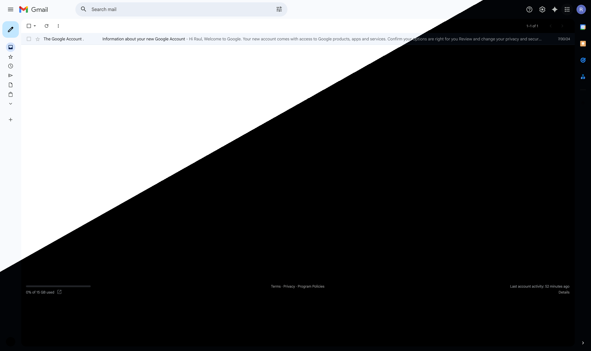

# Gmail Dark Mode Switcher

[](https://addons.mozilla.org/en-US/firefox/addon/gmail-dark-mode-switcher/)
[](https://addons.mozilla.org/en-US/firefox/addon/gmail-dark-mode-switcher/)
[](https://addons.mozilla.org/en-US/firefox/addon/gmail-dark-mode-switcher/)
[](https://opensource.org/licenses/MIT)

A Firefox extension that keeps Gmail's native theme synchronized with your operating system's light or dark preference, with manual controls whenever you want to override it.

## ✨ Features

- 🔄 **Auto Mode** - Follows your operating system's light or dark preference in real time
- 🌙 **Manual Dark Mode** - Forces Gmail's Dark theme regardless of system settings
- ☀️ **Manual Light Mode** - Forces Gmail's Default theme regardless of system settings
- 🎛️ **Accessible Popup Controls** - Provides one-click switching with clear selected-state feedback
- 🎨 **Native-First Styling** - Lets Gmail control the main interface, including text, icons, hover states, selections, and read/unread contrast
- 🌗 **Hybrid Message Rendering** - Adapts message content and directly styles Gmail's surrounding conversation surfaces
- ✍️ **Dark Compose Windows** - Covers popup, expanded, and fullscreen compose layouts without modifying sent-email formatting
- 🏞️ **Original Media Colors** - Counter-filters images, videos, iframes, canvas, and SVG content so media keeps its intended appearance
- 🔄 **Dynamic Gmail Support** - Reapplies styling as messages, conversations, and compose windows are added to the page
- 👥 **Multiple Accounts** - Synchronizes the active theme independently in each open Gmail tab

## How It Works

1. The toolbar popup stores the selected mode: Auto, Light, or Dark.
2. Each Gmail tab resolves that choice against the operating system preference.
3. The extension checks Gmail's current native theme marker.
4. When a change is needed, it briefly opens Gmail's theme settings out of view, selects Default or Dark, saves the choice, and closes the settings panel.
5. In dark mode, a small runtime layer identifies conversation and compose surfaces that Gmail still renders with light colors.
6. Message content is classified by its dominant background: light and plain-text messages are adapted, while emails already designed for dark mode are preserved.
7. Media elements inside adapted messages are counter-filtered to protect their original colors.

This design keeps most of the interface under Gmail's own theme system while fixing the message and compose areas that the native dark theme does not consistently cover.

## Privacy and Permissions

- **`storage` only** - Saves the selected Auto, Light, or Dark preference locally in Firefox
- **Gmail-only execution** - The content script runs only on `https://mail.google.com/*`
- **No `tabs` permission** - Version 1.4 no longer reads or monitors the browser's tab list
- **No data collection** - The extension does not collect, sell, or transmit personal data, email content, or browsing history

Because the extension selects Gmail's native theme, the chosen Default or Dark theme becomes part of Gmail's own account settings and may also appear in other Gmail sessions. In Auto mode, an open Gmail tab will synchronize it again when the system preference changes.

## Compatibility Notes

- Firefox 142 or newer is required by the current manifest.
- Gmail does not provide a public theme-switching API, so the extension interacts with its theme settings interface. Gmail layout changes may occasionally require selector updates.
- Message-body adaptation is visual only. It does not edit the source of received messages or add dark-mode formatting to outgoing email.

## 📸 Screenshots

### Light Mode vs Dark Mode




## 🚀 Installation

### From Mozilla Add-ons (Recommended)

1. Visit the [Mozilla Add-ons page](https://addons.mozilla.org/en-US/firefox/addon/gmail-dark-mode-switcher/)
2. Click "Add to Firefox"
3. Enjoy!

### Manual Installation (Developer Mode)

1. Download or clone this repository:
   ```bash
   git clone https://github.com/raulpop8/gmail-theme-switcher-firefox.git
   ```
2. Open Firefox and navigate to `about:debugging`
3. Click "This Firefox" in the sidebar
4. Click "Load Temporary Add-on..."
5. Navigate to the extension folder and select `manifest.json`

## 🎯 Usage

### Automatic Mode (Default)

Once installed, the extension automatically syncs with your system theme. No configuration needed!

### Manual Control

Click the extension icon in your toolbar to access theme controls:

- **Auto** - Follow system preferences
- **Light** - Always use light mode
- **Dark** - Always use dark mode

### Keyboard Shortcuts

Currently no keyboard shortcuts available. Coming in a future update!

## 📋 Changelog

### Version 1.5

- Preserved incoming emails that already use a predominantly dark design
- Added dominant-background detection for HTML message bodies and nested email tables
- Kept light HTML and transparent plain-text messages compatible with dark mode
- Added regression tests for dark, light, nested-table, and plain-text messages

### Version 1.4

- 🎨 Replaced global page inversion with Gmail's native Default and Dark themes
- 🌗 Added a targeted hybrid layer for message and compose surfaces Gmail leaves light
- 🔄 Added live system-theme detection to every open Gmail tab
- 💾 Retained Auto, Light, and Dark preferences across browser sessions
- ✉️ Fixed low-contrast plain-text messages and light conversation backgrounds
- 📰 Added selective message-body adaptation with original media colors preserved
- 🧩 Fixed conversation titles, sender details, metadata, and action controls
- ↩️ Darkened the reply/forward footer and buttons
- ✍️ Added complete popup, expanded, and fullscreen compose coverage
- 🪟 Darkened compose title bars, recipient and subject fields, editors, toolbars, and dynamically created panels
- 📝 Fixed nested black text in compose and reply editors
- ⋮ Darkened compose option menus and their nested submenus
- 🔎 Added runtime surface detection for Gmail's dynamic layout variants
- 🧹 Removed the background script and moved synchronization into the Gmail content script
- 🔒 Removed the unnecessary `tabs` permission; only local extension storage remains
- ♿ Added selected-state accessibility information to the popup controls
- ✅ Added dependency-free automated tests for theme resolution, native switching, surface detection, and CSS coverage

### Version 1.3

- ✨ Added popup UI for manual theme control
- 🎨 Three theme modes: Auto (system), Light, Dark
- 🌗 Popup adapts to system light/dark theme
- ☕ Added Ko-fi support button
- 🐛 Fixed white backgrounds in compose window
- 🔍 Fixed search bar staying white when switching accounts
- ✅ Improved overall dark mode consistency

### Version 1.2

- 🎨 Enhanced dark mode color accuracy
- 🐛 Bug fixes and performance improvements

### Version 1.1

- 🚀 Initial public release
- 🔄 Auto-sync with system preferences
- ⚫️ Basic dark mode implementation

---

<p align="center">
  Made with 💜 by <a href="https://raulpop.ro">Raul Pop</a>
</p>

<p align="center">
  <a href="https://ko-fi.com/raulpop" target="_blank" rel="noreferrer">
  
  </a>
</p>
